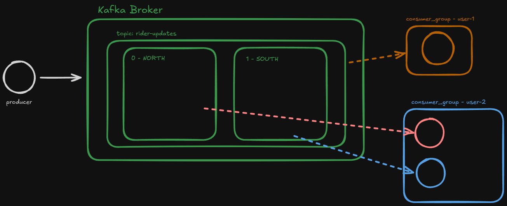

# kafka-basics

## Prerequisite
- Knowledge
  - Node.JS Intermediate level
  - Experience with designing distributed systems
- Tools
  - Node.js: [Download Node.JS](https://nodejs.org/en)
  - Docker: [Download Docker](https://www.docker.com)
  - VsCode: [Download VSCode](https://code.visualstudio.com)

## Commands
- Start Zookeper Container and expose PORT `2181`.
```bash
docker run -p 2181:2181 zookeeper
```
- Start Kafka Container, expose PORT `9092` and setup ENV variables.
```bash
docker run -p 9092:9092 \
-e KAFKA_ZOOKEEPER_CONNECT=<PRIVATE_IP>:2181 \
-e KAFKA_ADVERTISED_LISTENERS=PLAINTEXT://<PRIVATE_IP>:9092 \
-e KAFKA_OFFSETS_TOPIC_REPLICATION_FACTOR=1 \
confluentinc/cp-kafka
```

## 3 - Deities
* **Admin** - Setup Infra, Create Topics, Partitions, etc
* **Producers** - Produces Messages
* **Consumers** - Consumes Messages
* *BROKER* - Entire Kafka Service running on port 9092


## Pre-Workout Steps
* Kafka Needs Zookeeper, for Orchestration(auto load-balancing, etc)
    
    `By default, Zookeeper runs on port 2181`

* After that, we need to run, Kafka broker(or service) by providing Zookeeper's connection port, Kafka's own running port
  
    `By default, Kafka listens on port 9092`

* Run - 
  ```
    yarn init
  ```
* Add KafkaJs, using -
  ```
    yarn add kafkajs
  ```

* NOTE - For Code Help, refer, [KafkaJs](https://kafka.js.org/docs/getting-started)

## Code

`admin.js`
```js
const { kafka } = require("./client");

async function init() {
  const admin = kafka.admin();
  console.log("Admin connecting...");
  admin.connect();
  console.log("Adming Connection Success...");

  console.log("Creating Topic [rider-updates]");
  await admin.createTopics({
    topics: [
      {
        topic: "rider-updates",
        numPartitions: 2,
      },
    ],
  });
  console.log("Topic Created Success [rider-updates]");

  console.log("Disconnecting Admin..");
  await admin.disconnect();
}

init();
```


`client.js`
```js
const { Kafka } = require("kafkajs");

exports.kafka = new Kafka({
  clientId: "my-app",
  brokers: ["<PRIVATE_IP>:9092"],
});

```

`producer.js`
```js
const { kafka } = require("./client");
const readline = require("readline");

const rl = readline.createInterface({
  input: process.stdin,
  output: process.stdout,
});

async function init() {
  const producer = kafka.producer();

  console.log("Connecting Producer");
  await producer.connect();
  console.log("Producer Connected Successfully");

  rl.setPrompt("> ");
  rl.prompt();

  rl.on("line", async function (line) {
    const [riderName, location] = line.split(" ");
    await producer.send({
      topic: "rider-updates",
      messages: [
        {
          partition: location.toLowerCase() === "north" ? 0 : 1,
          key: "location-update",
          value: JSON.stringify({ name: riderName, location }),
        },
      ],
    });
  }).on("close", async () => {
    await producer.disconnect();
  });
}

init();
```
`consumer.js`
```js
const { kafka } = require("./client");
const group = process.argv[2];

async function init() {
  const consumer = kafka.consumer({ groupId: group });
  await consumer.connect();

  await consumer.subscribe({ topics: ["rider-updates"], fromBeginning: true });

  await consumer.run({
    eachMessage: async ({ topic, partition, message, heartbeat, pause }) => {
      console.log(
        `${group}: [${topic}]: PART:${partition}:`,
        message.value.toString()
      );
    },
  });
}

init();
```
## Running Locally
- Run Multiple Consumers
```bash
node consumer.js <GROUP_NAME>
```
- Create Producer
```bash
node producer.js
```
```bash
> tony south
> tony north
```

## VISUAL 

